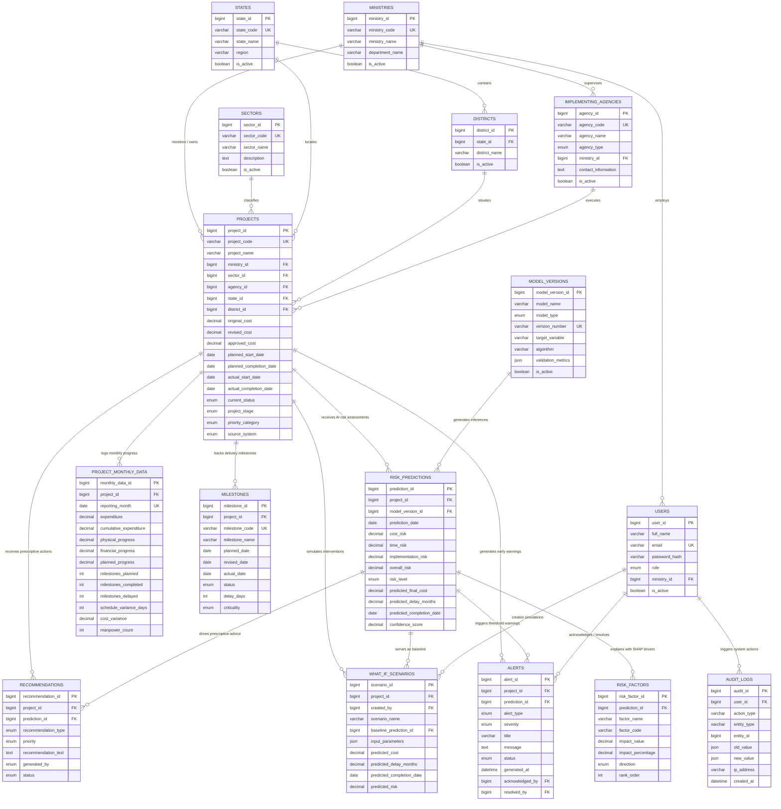

# PRAGATI-AI Entity-Relationship (ER) Diagram

```mermaid
erDiagram
    MINISTRIES ||--o{ PROJECTS : "monitors / owns"
    MINISTRIES ||--o{ IMPLEMENTING_AGENCIES : "supervises"
    MINISTRIES ||--o{ USERS : "employs"

    SECTORS ||--o{ PROJECTS : "classifies"

    STATES ||--o{ DISTRICTS : "contains"
    STATES ||--o{ PROJECTS : "locates"
    DISTRICTS ||--o{ PROJECTS : "situates"

    IMPLEMENTING_AGENCIES ||--o{ PROJECTS : "executes"

    PROJECTS ||--o{ PROJECT_MONTHLY_DATA : "logs monthly progress"
    PROJECTS ||--o{ MILESTONES : "tracks delivery milestones"
    PROJECTS ||--o{ RISK_PREDICTIONS : "receives AI risk assessments"
    PROJECTS ||--o{ ALERTS : "generates early warnings"
    PROJECTS ||--o{ RECOMMENDATIONS : "receives prescriptive actions"
    PROJECTS ||--o{ WHAT_IF_SCENARIOS : "simulates interventions"

    MODEL_VERSIONS ||--o{ RISK_PREDICTIONS : "generates inferences"

    RISK_PREDICTIONS ||--o{ RISK_FACTORS : "explains with SHAP drivers"
    RISK_PREDICTIONS ||--o{ ALERTS : "triggers threshold warnings"
    RISK_PREDICTIONS ||--o{ RECOMMENDATIONS : "drives prescriptive advice"
    RISK_PREDICTIONS ||--o{ WHAT_IF_SCENARIOS : "serves as baseline"

    USERS ||--o{ WHAT_IF_SCENARIOS : "creates simulations"
    USERS ||--o{ AUDIT_LOGS : "triggers system actions"
    USERS ||--o{ ALERTS : "acknowledges / resolves"

    MINISTRIES {
        bigint ministry_id PK
        varchar ministry_code UK
        varchar ministry_name
        varchar department_name
        boolean is_active
    }

    SECTORS {
        bigint sector_id PK
        varchar sector_code UK
        varchar sector_name
        text description
        boolean is_active
    }

    STATES {
        bigint state_id PK
        varchar state_code UK
        varchar state_name
        varchar region
        boolean is_active
    }

    DISTRICTS {
        bigint district_id PK
        bigint state_id FK
        varchar district_name
        boolean is_active
    }

    IMPLEMENTING_AGENCIES {
        bigint agency_id PK
        varchar agency_code UK
        varchar agency_name
        enum agency_type
        bigint ministry_id FK
        text contact_information
        boolean is_active
    }

    USERS {
        bigint user_id PK
        varchar full_name
        varchar email UK
        varchar password_hash
        enum role
        bigint ministry_id FK
        boolean is_active
    }

    PROJECTS {
        bigint project_id PK
        varchar project_code UK
        varchar project_name
        bigint ministry_id FK
        bigint sector_id FK
        bigint agency_id FK
        bigint state_id FK
        bigint district_id FK
        decimal original_cost
        decimal revised_cost
        decimal approved_cost
        date planned_start_date
        date planned_completion_date
        date actual_start_date
        date actual_completion_date
        enum current_status
        enum project_stage
        enum priority_category
        enum source_system
    }

    PROJECT_MONTHLY_DATA {
        bigint monthly_data_id PK
        bigint project_id FK
        date reporting_month UK
        decimal expenditure
        decimal cumulative_expenditure
        decimal physical_progress
        decimal financial_progress
        decimal planned_progress
        int milestones_planned
        int milestones_completed
        int milestones_delayed
        int schedule_variance_days
        decimal cost_variance
        int manpower_count
    }

    MILESTONES {
        bigint milestone_id PK
        bigint project_id FK
        varchar milestone_code UK
        varchar milestone_name
        date planned_date
        date revised_date
        date actual_date
        enum status
        int delay_days
        enum criticality
    }

    MODEL_VERSIONS {
        bigint model_version_id PK
        varchar model_name
        enum model_type
        varchar version_number UK
        varchar target_variable
        varchar algorithm
        json validation_metrics
        boolean is_active
    }

    RISK_PREDICTIONS {
        bigint prediction_id PK
        bigint project_id FK
        bigint model_version_id FK
        date prediction_date
        decimal cost_risk
        decimal time_risk
        decimal implementation_risk
        decimal overall_risk
        enum risk_level
        decimal predicted_final_cost
        decimal predicted_delay_months
        date predicted_completion_date
        decimal confidence_score
    }

    RISK_FACTORS {
        bigint risk_factor_id PK
        bigint prediction_id FK
        varchar factor_name
        varchar factor_code
        decimal impact_value
        decimal impact_percentage
        enum direction
        int rank_order
    }

    ALERTS {
        bigint alert_id PK
        bigint project_id FK
        bigint prediction_id FK
        enum alert_type
        enum severity
        varchar title
        text message
        enum status
        datetime generated_at
        bigint acknowledged_by FK
        bigint resolved_by FK
    }

    RECOMMENDATIONS {
        bigint recommendation_id PK
        bigint project_id FK
        bigint prediction_id FK
        enum recommendation_type
        enum priority
        text recommendation_text
        enum generated_by
        enum status
    }

    WHAT_IF_SCENARIOS {
        bigint scenario_id PK
        bigint project_id FK
        bigint created_by FK
        varchar scenario_name
        bigint baseline_prediction_id FK
        json input_parameters
        decimal predicted_cost
        decimal predicted_delay_months
        date predicted_completion_date
        decimal predicted_risk
    }

    AUDIT_LOGS {
        bigint audit_id PK
        bigint user_id FK
        varchar action_type
        varchar entity_type
        bigint entity_id
        json old_value
        json new_value
        varchar ip_address
        datetime created_at
    }
```
